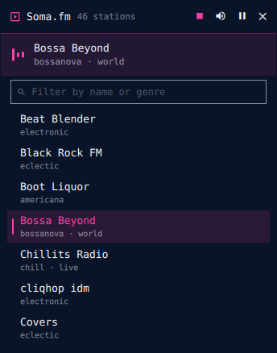
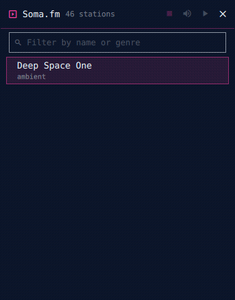

# Soma.fm for Omarchy

Listener-supported, commercial-free internet radio from [Soma.fm](https://somafm.com) in a small Omarchy shell window. All 46 stations, filter by name or genre, fully keyboard-drivable. Audio keeps streaming when the window is hidden.





## Install

From Omarchy Plugin Control (Super+Shift+P → Plugins), search for **Soma.fm** and install — or run the install command shown on the plugin's marketplace page.

## Remove

Uninstall from Omarchy Plugin Control, then delete the state directory if you want a fully clean slate:

```
rm -rf ~/.local/state/somafm
```

## External dependencies

- `curl` (included with Omarchy) — fetches the station list from somafm.com
- Audio playback uses QtMultimedia inside the shell; no extra packages needed

## Keyboard

The panel takes focus when it opens, so it is drivable without touching the mouse:

| Key | Action |
| --- | --- |
| `Up` / `Down` | Move the selection |
| `PgUp` / `PgDn` | Move by eight |
| `Home` / `End` | First / last station |
| `Enter` | Play the selected station |
| `Space` | Pause / resume |
| `Esc` | Clear the filter, or hide the panel |

Typing filters the list while arrows and `Enter` stay on the results, so `deep` + `Enter` plays Deep Space One.

## Usage

- Click the **󰐋 Soma** bar button (or summon via command palette) to open the miniwindow
- Type in the filter box to narrow stations by name or genre
- Click a station to play; click again to restart it
- Header buttons: mute, pause/resume, stop, hide window (audio continues), close
- Drag the header to reposition. Volume is your system volume — the stream is a normal PipeWire stream your volume keys and audio widget already control

## License

MIT — see [LICENSE](LICENSE). Soma.fm is a listener-supported service; consider [donating](https://somafm.com/support/) if you listen daily.
